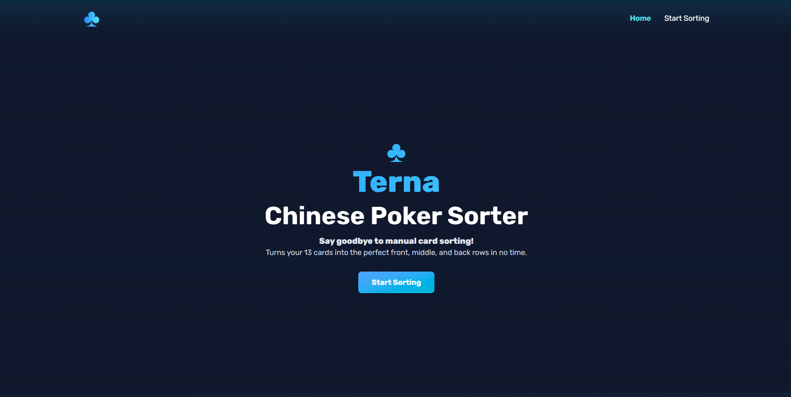
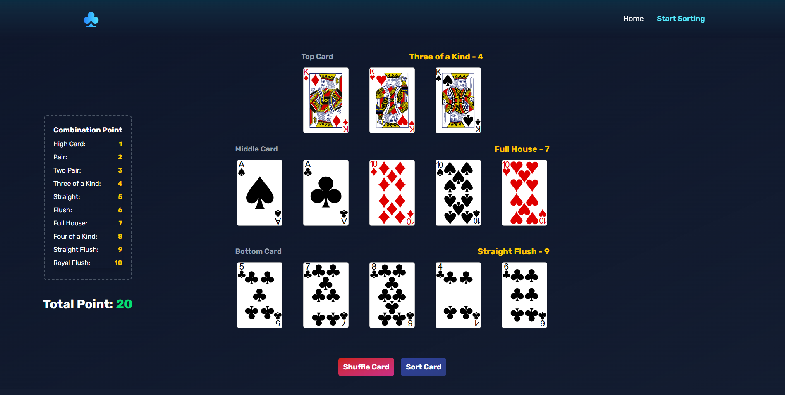

# ♣ TERNA

**TERNA** is a fun little web app that helps you arrange your **13 cards in Chinese Poker** into the most optimal hands — front, middle, and back.  
No more headaches figuring out which cards to put where, let the app do the smart sorting for you!

---

## ✨ Features
- Pick your 13 cards manually or shuffle them randomly.
- Automatic sorting using a **greedy algorithm** for the best combination.
- See the **combination name** (Full House, Straight, Pair, etc.) for each hand.
- Points system included — so you know how strong your setup is.
- Clean, modern UI built with **React + TailwindCSS**.

---

## 🎮 How it works
1. Open the **Start Sorting** page.  
2. Choose 13 cards (or hit **Shuffle**).  
3. Click **Sort Card**.  
4. Watch as your cards are instantly arranged into **Top (3 cards)**, **Middle (5 cards)**, and **Bottom (5 cards)** hands.  
5. Check the combo names and total points earned.

---

## 🚀 Tech Stack
- **Frontend**: React + Vite  
- **Backend**: JavaScript
- **Styling**: TailwindCSS  

---

## 🃏 About the Name
The name **Terna** comes from Latin, meaning *“a set of three.”*  
Just like how Chinese Poker splits your cards into three rows, the name fits perfectly — short, unique, and with a subtle card-game vibe.

---

## 📸 Screenshots



---

## 🤝 Contribution
Pull requests are welcome! If you’ve got ideas for new features, feel free to open an issue.

---

## 💻 Getting Started
Clone this repo and run locally:
```bash
git clone https://https://github.com/JuliusBourbon/Terna.git
cd Terna
npm install
npm run dev


